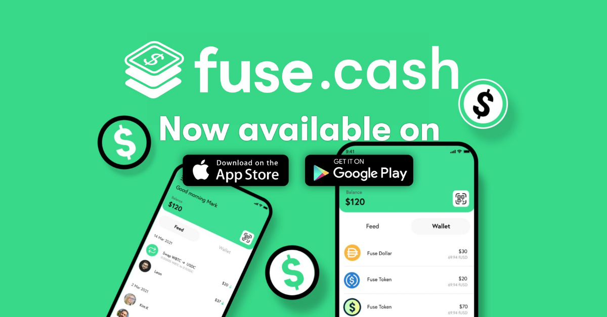

# fuse.cash wallet security guidelines

## Useful Guidelines on Keeping Your fuse.cash Wallet Secured 🔐

###  **1. Start with a Secure Foundation for Your Wallet**

Make sure your device is free of any malware and never install [**fuse.cash**](https://fuse.cash/) ****onto a rooted device. To make sure you are always using an authentic version of fuse.cash wallet, you should download the app exclusively from the links provided on our [**website**](https://fuse.cash/).

### **2. Never Share Your Recovery Phrase or Private Key with Anyone**

Your recovery phrase is the gateway access into your wallet, never share it with anyone! Keep it secured and stored away from anyone to avoid unauthorised access. 

### **3. Keep a Copy of Your Recovery Phrase Offline**

Always keep a copy of your recovery phrase stored offline! Writing it down on a piece of paper is the easiest but sometimes not the most durable solution. If you want something more durable than pen & paper, we recommend you to:

* Store it inside a Password Manager. Your recovery phrase will be stored inside an encrypted database either locally on the user’s device or remotely through an online cloud service. You can try solutions like [**Lastpass 2.4k**](https://lastpass.com/), [**1Password 3.4k**](https://1password.com/) or [**KeePassXC 1.1k**](https://keepassxc.org/)\*\*\*\*
* Note taking Apps like **Notes** **for iOS**, **Samsung Notes** **for Android** or **OneNote** let you create notes protected with a password. If you don’t want to use a Password manager, storing it inside a password protected \(and encrypted\) note also works.
* You can also try and look into [**CRYPTOTAG**](https://cryptotag.io/), [**Keepkey + Billfodl**](https://privacypros.io/keepkey/buy/), [**ColdTi**](https://coldti.com/), or other or other similar security product solutions for private key storage.

### **4. Use the in-app Backup Feature**

Remember to always backup your recovery phrase through the in-app security feature. 


**Backup your recovery phrase in fuse.cash wallet by navigating to 'Account' -&gt; 'Protect your wallet' -&gt; 'Back up' .**


In the event your phone is broken, stolen, lost or the app is accidentally deleted, your wallet can always be restored on a different phone using the recovery phrase. There is no reset or recovery process, so if you lose your phrase, you lose your funds!

### **5. Enable Passcode or Touch/Face ID**

To make sure only you have access to your Ecrox Cash mobile app, make sure to add another layer of authentication such as Passcode or Touch/Face ID to access your funds on your Ecrox Cash wallet. This prevents any bad actors accessing your wallet in case you lose your mobile device or leave it unsafe .  
****

