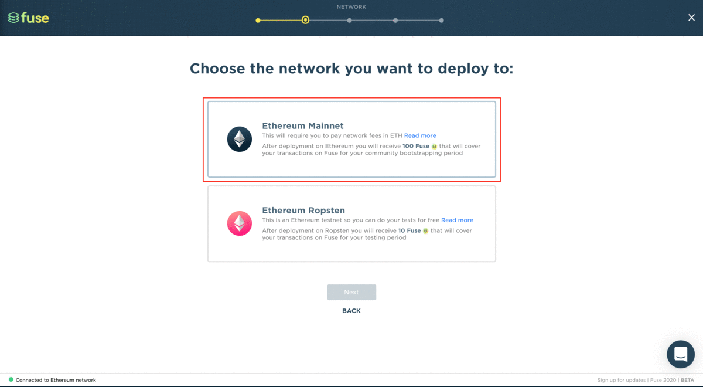

# Difference between using Ethereum Mainnet and Ethereum Ropsten

Both **Ethereum Mainnet** and **Ethereum Ropsten** networks use identical technology and software. The main difference between the two is that the Mainnet network is used for '**actual**' transactions with real monetary value, whereas the Ropsten network is used for '**testing**' smart contracts and decentralized applications called DApps. The Ethereum Ropsten network is essentially a simulation of the Ethereum Mainnet.

**Ethereum Mainnet**:  
- Transactions performed using Ether which holds monetary value  
- Tradable, exchangeable on public exchanges e.g. Coinbase  
- Used for transactions with monetary value  
- Transactions incur fees in Ether  
- 'Proof of Work' consensus, minable  
- Network ID = 1 

**Ethereum Ropsten**:  
- Transactions performed using Test Ether which does not hold monetary value  
- Not tradable, or exchangeable on public exchanges e.g. Coinbase  
- Transactions incur fees in Test Ether  
- 'Proof of Work' consensus, minable  
- Network ID ≠ 1


Most actions involved with your community and wallet e.g. community creation, using Studio features, etc. will incur fees which would be quite costly using ETH Mainnet, so for this reason, we strongly recommend switching to the Ropsten Test Network for testing purposes which uses test ETH balance that’s free for use to pay for those fees.


If you want to know more about the difference between the two networks, see this [Medium](https://medium.com/hummingbot/finance-3-0-wiki-testnet-vs-mainnet-8ab5b78d93#:~:text=The%20Ropsten%20Testnet%20is%20the%20most%20similar%20network%20to%20the%20Mainnet.&text=In%20contrast%2C%20some%20Ethereum%20test,dynamics%20and%20are%20more%20centralized.) article.

