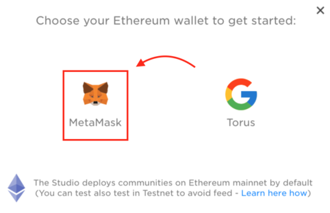
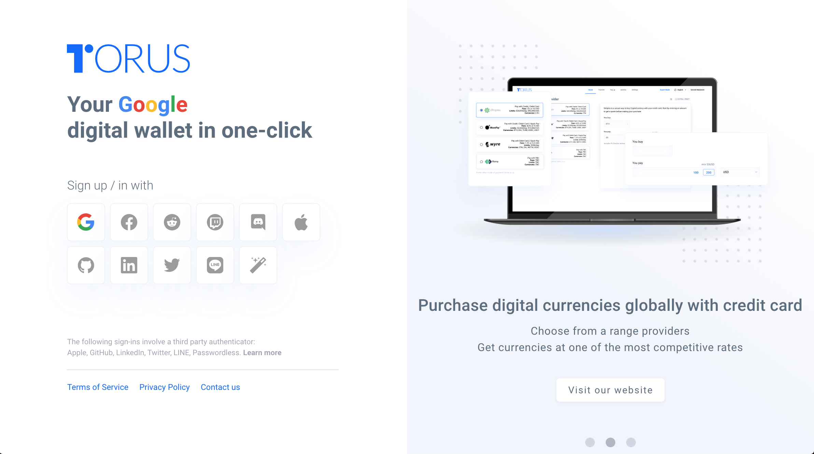
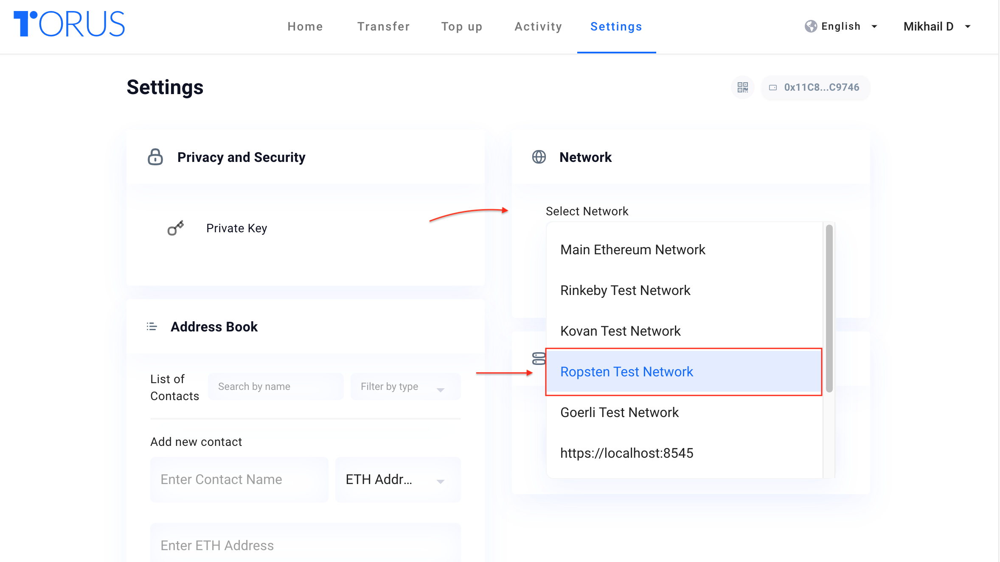
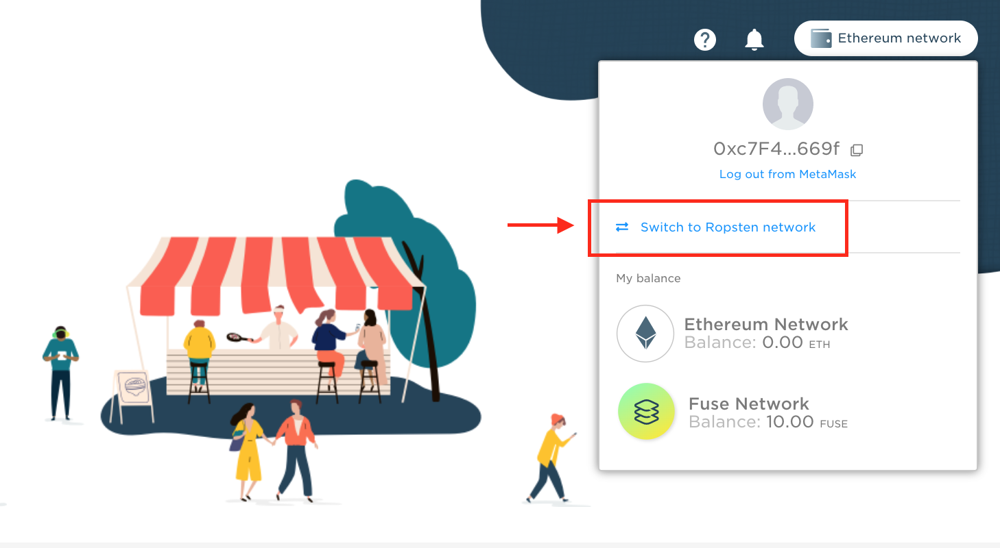
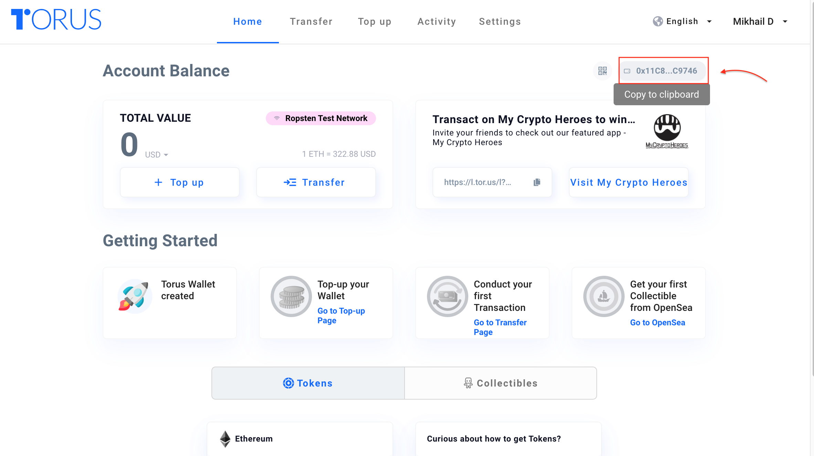
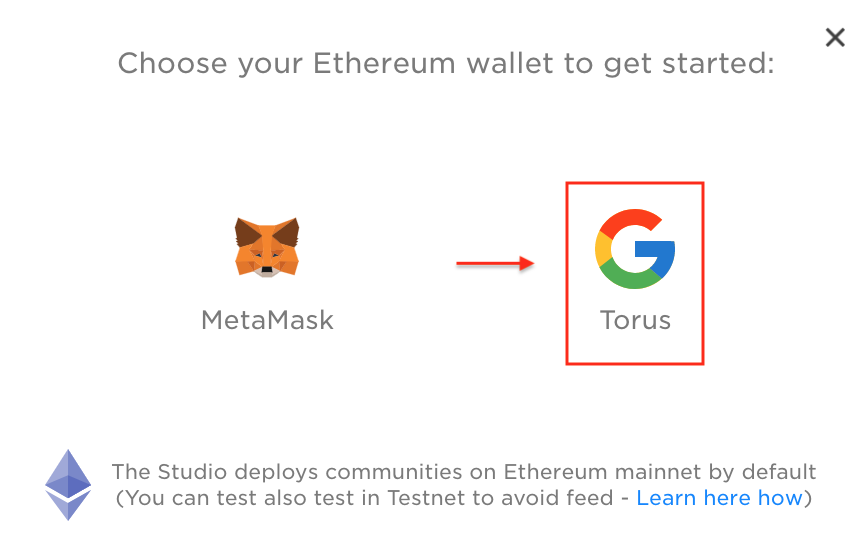
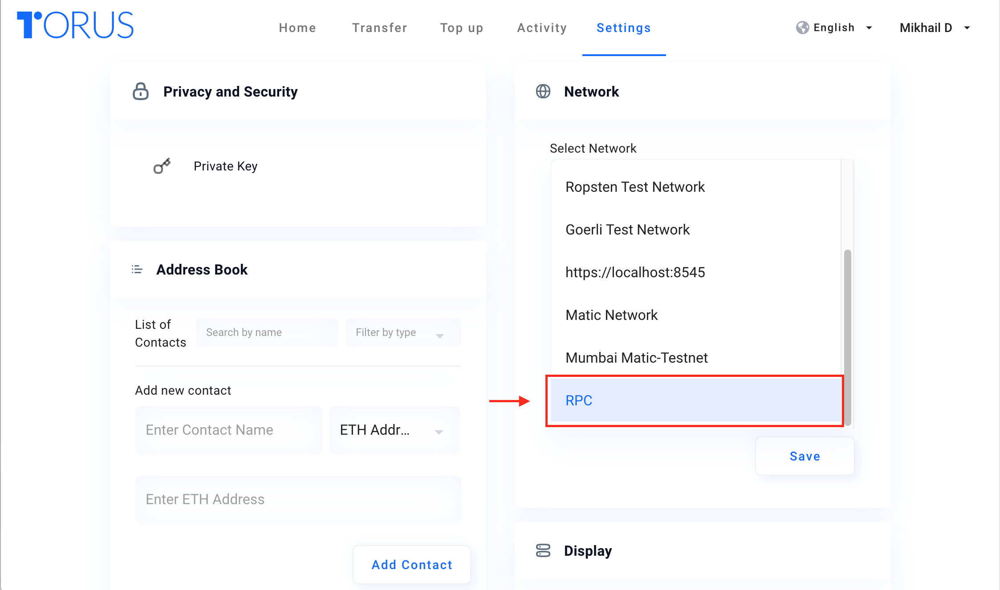
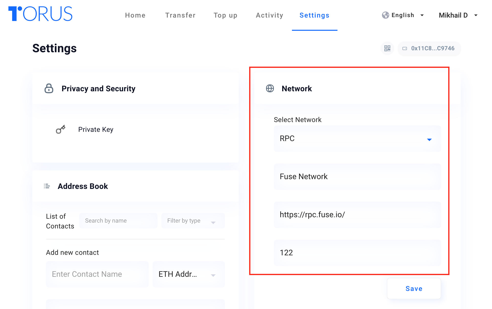

# Setting up Metamask and Torus

## Getting Started with Metamask

**Step 1 -**[ **Download**](https://metamask.io/download.html) ****and install **Metamask.io** to your Chrome, iOS, or Android. Once downloaded, create an account. You can choose between importing an existing account or creating a brand new one. You will be provided with a set of 'seed words' which you can use to login to your account. 


Make sure to save the 'seed words' in the specific order they are shown, ideally on a piece of paper that only you have access to.


**Step 2** **-** Next step will require you to **switch networks** on your Metamask from the Main Ethereum network to Ropsten Test Network.


Remember, most actions involved with your community and wallet will incur fees which would be quite costly using ETH Mainnet, so for this reason, we strongly recommend switching to the Ropsten Test Network which uses test ETH balance that’s free for use to pay for those fees.


**Step 3 -** Now let's **top up your wallet balance** by accessing the[ Ropsten Ethereum Faucet](https://faucet.ropsten.be/). To do so, copy your testnet account address by clicking on Metamask \(see picture below\) and paste it into the faucet, then click the 'send me test Ether' button. 


It may take from 5-30 seconds for the balance to update, so don't worry if it doesn't arrive quickly, simply refresh the page.



Copy your **wallet address**



Paste the **wallet address** in the field and press **send me test Ether**


**Step 4 -** Congratulations! You now have Ropsten ETH to use! Now you can **access** the[ Ecrox studio](https://studio.ecroxscan.com/) which you can also navigate to from the main page of the Ecrox website. Once there, click on the **'connect wallet'** button, where you can choose to connect with either Metamask \(recommended\) or Torus. Press **connect with Metamask** and vualá!


Click **connect wallet**



Choose **MetaMask**



Click **connect**


**Step 5 -** To perform actions on the Ecrox Studio after issuing your community, you will need to **add** the **Ecrox Custom RPC** to your Metamask. To do so, click on the Metamask icon in your browser, then **select** network and **custom RPC**. Type in the following information into the corresponding fields:


* **Network name:** Ecrox
* **New RPC URL:**[ ****https://mainnet-rpc.ecroxscan.com](https://mainnet-rpc.ecroxscan.com)
* **ChainID:** 988207
* **Symbol:** ECROX
* **Block Explorer URL:**[ ****https://ecroxscan.com](https://ecroxscan.com)


After doing so, **do not** **switch** to this new **custom network** just yet. It will be needed **after** you issue your community and tokens, inside the Ecrox Studio.

**Step 6 -** Ready, set, launch! You are ready to **create your own community** on Ecrox studio! Simply press the [**launch your community**](https://studio.ecroxscan.com/view/issuance) ****action button to begin the process. 

Follow the tutorial in the next section of the walkthroughs called '**Community Creation Tutorial**'.

## Getting Started with Torus

**Step 1 -** Visit the ****[**Torus**](https://app.tor.us/) ****website and **sign up** using your Google account.

**Step 2** **-** Next, switch to Ropsten Test Network by clicking on the 'Settings' section in your account and pick **Ropsten Test Network** in the 'Network' tab. You can also switch the network on the  Ecrox Studio main page by pressing the **wallet tab** and picking '**Switch to Ropsten network**', then clicking confirm.


Remember, most actions involved with your community and wallet will incur fees which would be quite costly using ETH, so for this reason, we strongly recommend switching to the Ropsten Test Network which uses test ETH balance that can be used to pay for those fees instead.


**Step 3 -** Now let's **top up your wallet balance** by accessing the[ Ropsten Ethereum Faucet](https://faucet.ropsten.be/). To do so, **copy** your wallet address by navigating \(see picture below\) it on the top right corner of your Torus account page, click '**copy to clipboard**', and **paste** the address into the Ropsten Ethereum Faucet search. After pasting the address, click '**Send me test Ether**'.


It may take from 5-30 seconds for the balance to update, so don't worry if it doesn't arrive quickly, simply refresh the page.



Copy your **wallet address**



Paste the **wallet address** in the field and press **send me test Ether**


**Step 4 -** Congratulations! You now have Ropsten ETH to use! Now you can **access** the[ Ecrox studio](https://studio.ecroxscan.com/) which you can also navigate to from the main page of the Ecrox website. Once there, click on the **'connect wallet'** button, where you can choose to connect with either Metamask \(recommended\) or Torus. Press **connect with Torus**.


Click **connect wallet**



Choose **Torus**


**Step 5 -** To use the studio, you will need to **add** the **Ecrox Custom RPC** to your Torus network settings. To do so, click on the 'Settings' section in your Torus account, then **select** network and custom RPC. Type in the following:


* **Network name:** Ecrox
* **New RPC URL:**[ ****https://mainnet-rpc.ecroxscan.com](https://mainnet-rpc.ecroxscan.com)
* **ChainID:** 988207


Make sure to have the network settings on '**Ropsten Test Network'** for testing purposes or **Main Ethereum Network** when you are ready to launch an official community. You will only need to change to the new RPC Network **after** you have created your community to perform actions on the Ecrox Studio.

**Step 6 -** Ready, set, launch! You are ready to **create your own community** on Ecrox studio! Simply press the [launch you community](https://studio.ecroxscan.com/view/issuance) ****action button to begin the process.

Follow the tutorial in the next section of the walkthroughs called '**Community Creation Tutorial**'.

