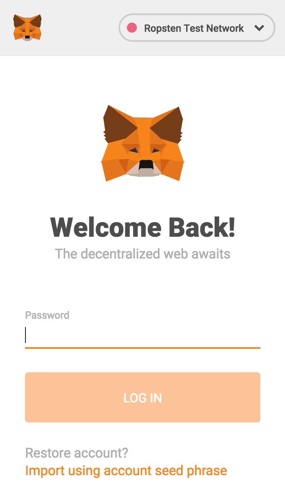

# Testing the studio for free on Ropsten

MetaMask is an Ethereum wallet that runs as a Chrome extension, it allows users to interact with decentralized apps and use their wallet to sign transactions on web3.0 decentralized apps like the Ecrox Studio. Before launching your community on mainnet you can test our platform for free on Ropsten. Because using Ethereum requires paying fee's you will need to have ETH on Ropsten before launching your community. Here is how to do it:

## Install & Get some ETH

1. Install the browser extension from Metamask.io.
2. Create a wallet and write your 12 word mnemonic to be able to restore it in the future.
3. Change the network selector on the top of the wallet to **Ropsten network**
4. Go to Ropsten Ether Faucet - [here](https://faucet.ropsten.be/)
5. Paste your address in the text field to get some ETH on Ropsten.
6. Go to the [Ecrox studio](https://studio-qa.ecroxscan.com/) and start to explore

