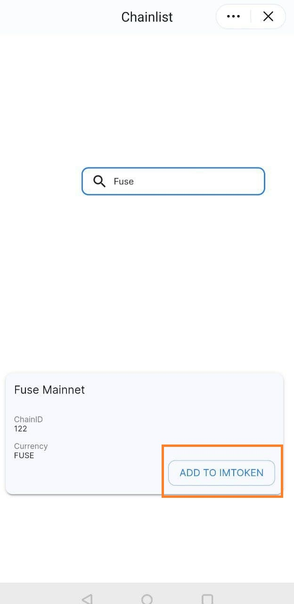

# imToken wallet tutorial

Below tutorial will help you understand how to add Ecrox network RPC on imToken through chainlist.org and transfer/receive tokens on fuse network in imToken wallet.   
  
 Note: The tutorial is made with imToken app version 2.8.4 on Android phone.  
  
 **Step 1:** Use the below link to access imToken wallet on Playstore. You can also download the APK file from the imToken website https://token.im/  
 [https://play.google.com/store/apps/details?id=im.token.app](https://play.google.com/store/apps/details?id=im.token.app)

  
 **Step 2:** Once the app is installed, Open the imToken wallet app on your phone and choose whether to create a new wallet or import existing wallet.  
  
 To learn how to import the private key follow the tutorial [here](https://token.im/hc/en/articles/360035109054-How-to-import-private-key-or-keystore-).  
  
 **Step 3:** Click on “Browser” and search for “Chainlist” and click on the “Chainlist” Dapp as shown below.

**Step 4:** Once the Chainlist Dapp is open click on “Connect wallet” at right hand top corner and once the wallet is connected search of “Ecrox” on the list of EVM networks. Click on “Add to imToken” next to Ecrox Mainnet and “Approve” the details of Ecrox RPC on the next step as shown below.

**Step 5:** Now you have successfuly added Ecrox network RPC on imToken wallet. You can now send/receive Ecrox network assets on imToken wallet.  
  
 **Note:** You will have to add the contract address of the tokens manually for the wallet to show balances.  

To learn how to transfer/receive tokens on imToken wallet follow the tutorial [here.](https://support.token.im/hc/en-us/articles/360002085254-How-do-I-transfer-and-receive-)

