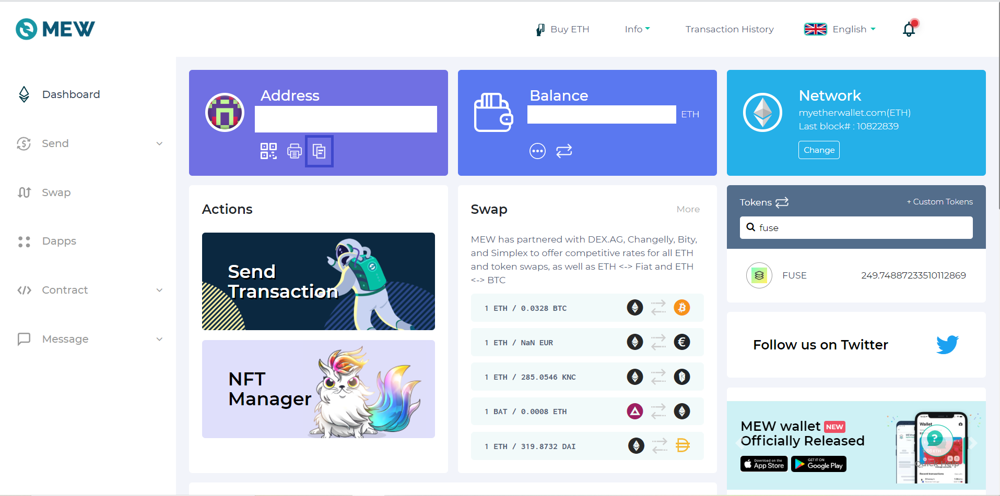

# MEW Tutorial

**Step 1:** Go to [www.myetherwallet.com](http://www.myetherwallet.com/) and click on **“Access my Wallet”**.

**Step 2:** MyEtherWallet has various methods through which you can login to your Ethereum wallet. This is basically divided into four categories as shown below.

* You can login through WalletConnect which many of the mobile wallets support.
* You can connect various Hardware wallets to MEW.
* Various soft login methods like Private Key, Mnemonic phrase and Keystore file.

**Step 3:** Once you have logged in to your address through any of the methods mentioned above, you can see your Ethereum address, Ethereum balance etc.

**Step 4: ECROX** is already present in the default list of tokens on MEW. You just have to search **ECROX** on the right hand side \(as shown below\) to view your **ECROX** balance on that particular Ethereum address.

Now let’s learn how to Send/Receive **ECROX** on MEW.

**To receive ECROX tokens:** Once completing Steps 1-4, Click on **“Copy Address”** just below your **“Address”** \(Public key\) as highlighted below. This is the address to which you can receive **ECROX** and can be viewed on your MEW once confirmed on-chain.

**To send ECROX:** Click **“Send Transaction”**. When you have **ECROX** in your wallet you should be able to select **“ECROX”** from the **“Type”** drop down. Enter the **“Amount”** you want to send and also the **“To Address”** to which you want to transfer **ECROX**. You can also click on **“Edit”** if you want to change gas prices. Once you have entered all the details click on **“Send Transaction”.**

* If you are using **Hardware wallets/Wallet connect** to login then you will get a popup screen on Hardware wallets/Wallet connect to approve the transaction. Only after approving you will see the final confirmation dialog box will appear.
*  If you are using soft login methods then the final confirmation screen will appear once you click “Send Transaction”.

Note: You need to have Ethereum in your wallet which will be used as “Gas fees” to send ECROX on MEW.

Double check all the details, click **“Confirm and Send”** and wait for your transaction to be confirmed on-chain.

We hope this tutorial helped you to use MEW and send/receive **ECROX**. Until next time friends!

